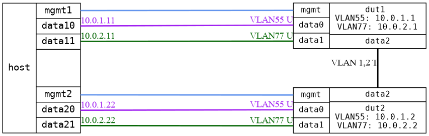

=== IGMP VLAN
==== Description
Test tagged IGMP control traffic and that VLAN separation is respected for multicast

==== Topology
ifdef::topdoc[]
image::../../test/case/ietf_interfaces/igmp_vlan/topology.png[IGMP VLAN topology]
endif::topdoc[]
ifndef::topdoc[]
ifdef::testgroup[]
image::igmp_vlan/topology.png[IGMP VLAN topology]
endif::testgroup[]
ifndef::testgroup[]

endif::testgroup[]
endif::topdoc[]
==== Test sequence
. Initialize
. Configure device
. Start multicast sender on host:data10, group 224.2.2.2
. Start multicast sender on host:data21, group 224.1.1.1
. Verify group 224.2.2.2 is flooded to host:data20
. Verify group 224.1.1.1 is flooded to host:data11
. Verify group 224.2.2.2 on host:data10, 224.1.1.1 on host:data20, 224.2.2.2 on host:data11 and 224.1.1.1 on host:data21 is not received
. Join multicast group 224.2.2.2 on host:data20
. Verify group 224.2.2.2 on host:data10, 224.1.1.1 on host:data20, 224.2.2.2 on host:data11 and 224.1.1.1 on host:data21 is not received
. Verify group 224.2.2.2 is forwarded to host:data20
. Verify group 224.1.1.1 is forwarded to host:data11

<<<

