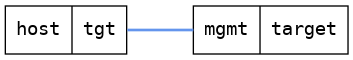

=== Interface with IPv4
==== Description
Test that it is possible to set and remove the IPv4 address on a interface

==== Topology
ifdef::topdoc[]
image::../../test/case/ietf_interfaces/ipv4_address/topology.png[Interface with IPv4 topology]
endif::topdoc[]
ifndef::topdoc[]
ifdef::testgroup[]
image::ipv4_address/topology.png[Interface with IPv4 topology]
endif::testgroup[]
ifndef::testgroup[]

endif::testgroup[]
endif::topdoc[]
==== Test sequence
. Connect to target
. Configure IPv4 address 10.10.10.20/24 on target:mgmt
. Verify '10.10.10.20/24' exist on target:mgmt
. Verify target:mgmt no longer has the address 10.10.10.20

<<<

