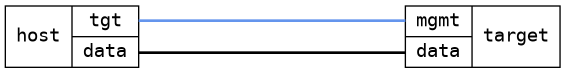

=== Interface IPv6 autoconf for bridges
==== Description
Verify IPv6 autoconf on a bridge is properly set up for global prefix.
See issue #473 for details.

==== Topology
ifdef::topdoc[]
image::/home/lazzer/Documents/addiva/infix/test/case/ietf_interfaces/ipv6_address/topology.png[Interface IPv6 autoconf for bridges topology]

endif::topdoc[]
ifndef::topdoc[]
ifdef::testgroup[]
image::lazzer/Documents/addiva/infix/test/case/ietf_interfaces/ipv6_address/topology.png[Interface IPv6 autoconf for bridges topology]

endif::testgroup[]
ifndef::testgroup[]

endif::testgroup[]
endif::topdoc[]
==== Test sequence
. Initializing ...
. Setting up bridge with IPv6 SLAAC for global prefix ...
. Verifying sysctl autoconf setting ...

<<<

