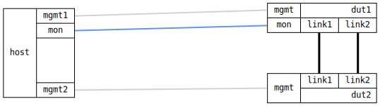

=== Ling Aggregation Basic
==== Description
Verify communication over a link aggregate in static and LACP operating
modes during basic failure scenarios.

.Internal network setup, PC verifies connectivity with dut2 via dut1
ifdef::topdoc[]
image::../../test/case/ietf_interfaces/lag_basic/lag-basic.svg[Internal networks]
endif::topdoc[]
ifndef::topdoc[]
ifdef::testgroup[]
image::lag_basic/lag-basic.svg[Internal networks]
endif::testgroup[]
ifndef::testgroup[]
image::lag-basic.svg[Internal networks]
endif::testgroup[]
endif::topdoc[]

The host verifies connectivity with dut2 via dut1 over the aggregate for
each test step using the `mon` interface.

==== Topology
ifdef::topdoc[]
image::{topdoc}../../test/case/ietf_interfaces/lag_basic/topology.svg[Ling Aggregation Basic topology]
endif::topdoc[]
ifndef::topdoc[]
ifdef::testgroup[]
image::lag_basic/topology.svg[Ling Aggregation Basic topology]
endif::testgroup[]
ifndef::testgroup[]

endif::testgroup[]
endif::topdoc[]
==== Test sequence
. Set up topology and attach to target DUTs
. Set up LACP link aggregate, lag0, on dut1 and dut2
. Verify failure modes for lacp mode
. Set up static link aggregate, lag0, on dut1 and dut2
. Verify failure modes for static mode

<<<

