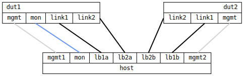

=== Link Aggregation Silent Failure
==== Description
Verify communication over a link aggregate in static and LACP mode when
member links stop passing traffic without any carrier loss.  In static
mode the ARP monitor is used in both ends of the lag, in LACP mode this
is not necessary, and must in fact be disabled.

.Logical network setup, link breakers (lb1 & lb2) here managed by host PC
ifdef::topdoc[]
image::../../test/case/ietf_interfaces/lag_failure/lag-failure.svg[]
endif::topdoc[]
ifndef::topdoc[]
ifdef::testgroup[]
image::lag_failure/lag-failure.svg[]
endif::testgroup[]
ifndef::testgroup[]
image::lag-failure.svg[]
endif::testgroup[]
endif::topdoc[]

The host verifies connectivity with dut2 via dut1 over the aggregate for
each test step using the `mon` interface.

==== Topology
ifdef::topdoc[]
image::../../test/case/ietf_interfaces/lag_failure/topology.svg[Link Aggregation Silent Failure topology]
endif::topdoc[]
ifndef::topdoc[]
ifdef::testgroup[]
image::lag_failure/topology.svg[Link Aggregation Silent Failure topology]
endif::testgroup[]
ifndef::testgroup[]

endif::testgroup[]
endif::topdoc[]
==== Test sequence
. Set up topology and attach to target DUTs
. Set up static link aggregate, lag0, on dut1 and dut2
. Verify failure modes for static mode
. Set up LACP link aggregate, lag0, on dut1 and dut2
. Verify failure modes for lacp mode

<<<

