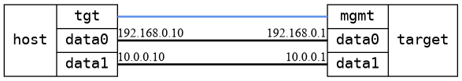

=== Routing basic
==== Description
Test that ipv4 forwarding setting in configuration is respected

==== Topology
ifdef::topdoc[]
image::/home/lazzer/Documents/addiva/infix/test/case/ietf_interfaces/routing_basic/topology.png[Routing basic topology]

endif::topdoc[]
ifndef::topdoc[]
ifdef::testgroup[]
image::lazzer/Documents/addiva/infix/test/case/ietf_interfaces/routing_basic/topology.png[Routing basic topology]

endif::testgroup[]
ifndef::testgroup[]

endif::testgroup[]
endif::topdoc[]
==== Test sequence
. Initialize
. Setup host
. Enable forwarding
. Traffic is forwarded
. Disable forwarding
. Traffic is not forwarded

<<<

