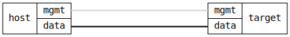

=== Interface Speed Duplex (Copper)
==== Description
Verify that auto-negotiation results in expected speed/duplex mode.

==== Topology
ifdef::topdoc[]
image::{topdoc}../../test/case/ietf_interfaces/speed_duplex_copper/topology.svg[Interface Speed Duplex (Copper) topology]
endif::topdoc[]
ifndef::topdoc[]
ifdef::testgroup[]
image::speed_duplex_copper/topology.svg[Interface Speed Duplex (Copper) topology]
endif::testgroup[]
ifndef::testgroup[]

endif::testgroup[]
endif::topdoc[]
==== Test sequence
. Set up topology and attach to target DUT
. Enable target interface
. Set fixed 10/full
. Set fixed 10/half
. Set fixed 100/full
. Set fixed 100/half
. Switch to auto-negotiation mode for target and host
. Configure host to advertise 10/Full only
. Configure host to advertise 10/Half only
. Configure host to advertise 100/Full only
. Configure host to advertise 100/Half only
. Configure host to advertise 10/half + 10/full + 100/half
. Configure host to advertise 10/half + 10/full + 100/half + 100/full + 1000/full

<<<

