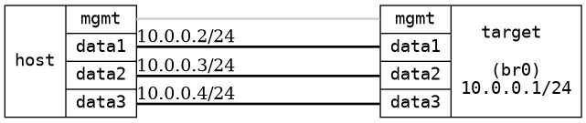

=== Static multicast filters
==== Description
Verify that static multicast filters work (remember that snooping needs to
enabled when using static multicast filters)

==== Topology
ifdef::topdoc[]
image::../../test/case/ietf_interfaces/static_multicast_filters/topology.png[Static multicast filters topology]
endif::topdoc[]
ifndef::topdoc[]
ifdef::testgroup[]
image::static_multicast_filters/topology.png[Static multicast filters topology]
endif::testgroup[]
ifndef::testgroup[]

endif::testgroup[]
endif::topdoc[]
==== Test sequence
. Initialize
. Configure device without static filter
. Setup sender and receivers
. Verify that the group is flooded on all ports
. Install group filter
. Verify that the group is still forwarded to the member
. Verify that the group is no longer forwarded to the non-member

<<<

