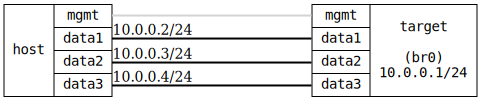

=== Static multicast filters
==== Description
Verify that static multicast filters work (remember that snooping needs to
enabled when using static multicast filters)

....
              .1
 .---------------------------.
 |            DUT            |
 '-data1-----data2-----data3-'
     |         |         |
     |         |         |      10.0.0.0/24
     |         |         |
 .-data1-. .-data2-. .-data3-.
 | msend | | mrecv | | !memb |
 '-------' '-------' '-------'
    .2        .3        .4
             HOST
....

==== Topology
ifdef::topdoc[]
image::{topdoc}../../test/case/ietf_interfaces/static_multicast_filters/topology.svg[Static multicast filters topology]
endif::topdoc[]
ifndef::topdoc[]
ifdef::testgroup[]
image::static_multicast_filters/topology.svg[Static multicast filters topology]
endif::testgroup[]
ifndef::testgroup[]

endif::testgroup[]
endif::topdoc[]
==== Test sequence
. Set up topology and attach to target DUTs
. Configure device without static filter
. Start multicast sender on host:data1, group 224.1.1.1
. Verify that 224.1.1.1 is flooded to host:data2 and host:data3
. Enable IPv4 multicast filter on host:data2, group 224.1.1.1
. Verify that the group is still forwarded to host:data2
. Verify that the group is no longer forwarded to host:data3
. Start MAC multicast sender on host:data1, group 01:00:00:01:02:03
. Verify MAC multicast 01:00:00:01:02:03 is flooded to host:data2 and host:data3
. Enable MAC multicast filter on host:data2, group 01:00:00:01:02:03
. Verify that the MAC group is still forwarded to host:data2
. Verify that the MAC group is no longer forwarded to host:data3

<<<

