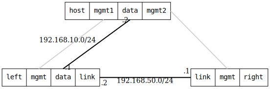

=== GRETAP point-to-point
==== Description
Test setting up gretap tunnels using IPv4 and IPv6,
and ends with a connectivity test.

==== Topology
ifdef::topdoc[]
image::{topdoc}../../test/case/ietf_interfaces/tunnel_basic/topology.svg[GRETAP point-to-point topology]
endif::topdoc[]
ifndef::topdoc[]
ifdef::testgroup[]
image::tunnel_basic/topology.svg[GRETAP point-to-point topology]
endif::testgroup[]
ifndef::testgroup[]

endif::testgroup[]
endif::topdoc[]
==== Test sequence
. Set up topology and attach to target DUTs
. Configure DUTs
. Verify connectivity host:data to 10.0.0.2
. Verify connectivity host:data to 2001:db8::c0a8:0a02

<<<

