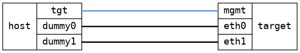

=== Verify that VETH pairs can be deleted
==== Description
```
     veth0b       veth0a        e1    e2
          `---------'
```

Each test step to create, add address, or delete an interace is distinct
from any other step.  This to trigger a new configuration "generation".

==== Topology
ifdef::topdoc[]
image::../../test/case/ietf_interfaces/veth_delete/topology.png[Verify that VETH pairs can be deleted topology]
endif::topdoc[]
ifndef::topdoc[]
ifdef::testgroup[]
image::veth_delete/topology.png[Verify that VETH pairs can be deleted topology]
endif::testgroup[]
ifndef::testgroup[]

endif::testgroup[]
endif::topdoc[]
==== Test sequence
. Initialize
. Create VETH pair
. Verify VETH pair exists
. Set IP address on target:eth0 (dummy op)
. Set IP address on target:eth1 (dummy op)
. Reset configuration
. Verify target:eth0 and target:eth1 still exist
. Verify VETH pair have been removed


<<<

