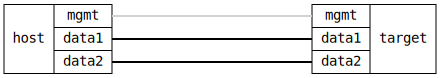

=== Verify that VETH pairs can be deleted
==== Description
```
     veth0b       veth0a        data1    data2
          `---------'
```

Each test step to create, add address, or delete an interace is distinct
from any other step.  This to trigger a new configuration "generation".

==== Topology
ifdef::topdoc[]
image::{topdoc}../../test/case/ietf_interfaces/veth_delete/topology.svg[Verify that VETH pairs can be deleted topology]
endif::topdoc[]
ifndef::topdoc[]
ifdef::testgroup[]
image::veth_delete/topology.svg[Verify that VETH pairs can be deleted topology]
endif::testgroup[]
ifndef::testgroup[]

endif::testgroup[]
endif::topdoc[]
==== Test sequence
. Set up topology and attach to target DUT
. Create VETH pair
. Verify interfaces 'veth0a' and 'veth0b' exist
. Set IP address on target:data1 (dummy op)
. Set IP address on target:data2 (dummy op)
. Reset configuration
. Verify target:data1 and target:data2 still exist
. Verify VETH pair have been removed


<<<

