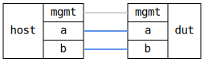

=== VLAN Interface Termination
==== Description
Verify that VLANs stacked on top of an interfaces that are also
attached to a VLAN filtering bridge are always locally terminated.

....
.---------------------------.
|           target          |
|                           |
|  data0.10  br0  data1.10  |
|      \    /   \    /      |
'------data0-----data1------'
         |         |
         |         |
.------data0-----data1------.
|      /      :     \       |
|  data0.10   :   data1.10  |
|             :             |
|           host            |
|             :             |
'---------------------------'
....

In this setup, even though VLAN 10 is allowed to ingress and egress on
both `data0` and `data1`, _bridging_ of packets from one to the other
must _not_ be allowed.

==== Topology
ifdef::topdoc[]
image::{topdoc}../../test/case/ietf_interfaces/vlan_iface_termination/topology.svg[VLAN Interface Termination topology]
endif::topdoc[]
ifndef::topdoc[]
ifdef::testgroup[]
image::vlan_iface_termination/topology.svg[VLAN Interface Termination topology]
endif::testgroup[]
ifndef::testgroup[]

endif::testgroup[]
endif::topdoc[]
==== Test sequence
. Set up topology and attach to target
. Configure bridge and VLAN interfaces on target
. Configure IP addresses and VLAN interfaces on host
. Verify that host:data0 reaches host:data1 with untagged packets
. Verify that traffic on VLAN 10 from host:data0 does not reach host:data1
. Verify that host:data0 can reach target on VLAN 10
. Verify that host:data1 can reach target on VLAN 10

<<<

