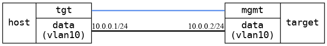

=== VLAN ping connectivity
==== Description
Very basic test if the VLAN interface configuration works.

==== Topology
ifdef::topdoc[]
image::../../test/case/ietf_interfaces/vlan_ping/topology.png[VLAN ping connectivity topology]
endif::topdoc[]
ifndef::topdoc[]
ifdef::testgroup[]
image::vlan_ping/topology.png[VLAN ping connectivity topology]
endif::testgroup[]
ifndef::testgroup[]

endif::testgroup[]
endif::topdoc[]
==== Test sequence
. Configure VLAN 10 interface on target:data with IP 10.0.0.2
. Waiting for links to come up
. Ping 10.0.0.2 from VLAN 10 on host:data with IP 10.0.0.1
. Remove VLAN interface from target:data, and test again (should not be able to ping)

<<<

