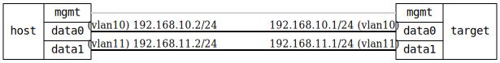

=== VLAN Interface Ingress/Egress QoS
==== Description
Inject different packets from the host and verify that the VLAN priority
is handled correctly for traffic ingressing and egressing a VLAN interface.

The test verifies that ingress PCP priority is mapped correctly to internal
priority ('from pcp' or static '0..7'), and that internal priority is mapped
correctly to PCP on egress ('from internal priority' or static '0..7').

    { "id": 1, "pcp": 0, "ingress": 0,          "egress": 0,               "expect": 0 },
    { "id": 2, "pcp": 0, "ingress": 0,          "egress": 1,               "expect": 1 },
    { "id": 3, "pcp": 0, "ingress": 3,          "egress": 0,               "expect": 0 },
    { "id": 4, "pcp": 0, "ingress": 4,          "egress": "from-priority", "expect": 4 },
    { "id": 5, "pcp": 5, "ingress": "from-pcp", "egress": "from-priority", "expect": 5 },
    { "id": 6, "pcp": 6, "ingress": "from-pcp", "egress": "from-priority", "expect": 6 },

==== Topology
ifdef::topdoc[]
image::../../test/case/ietf_interfaces/vlan_qos/topology.svg[VLAN Interface Ingress/Egress QoS topology]
endif::topdoc[]
ifndef::topdoc[]
ifdef::testgroup[]
image::vlan_qos/topology.svg[VLAN Interface Ingress/Egress QoS topology]
endif::testgroup[]
ifndef::testgroup[]

endif::testgroup[]
endif::topdoc[]
==== Test sequence
. Set up topology and attach to target DUT
. Apply initial config without priority mapping
. Setup host VLANs
. Verify that packet with id=1 egressed with pcp=0
. Verify that packet with id=2 egressed with pcp=1
. Verify that packet with id=3 egressed with pcp=0
. Verify that packet with id=4 egressed with pcp=4
. Verify that packet with id=5 egressed with pcp=5
. Verify that packet with id=6 egressed with pcp=6

<<<

