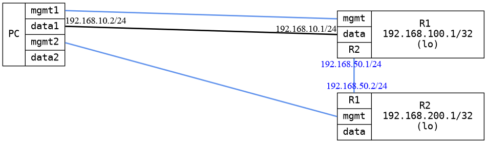

=== OSPF Basic
==== Description
Very basic OSPF test just test that OSPF sends HELLO packets between the DUTs
and that they exchange routes, ending with a simple connectivity check.

==== Topology
ifdef::topdoc[]
image::../../test/case/ietf_routing/ospf_basic/topology.png[OSPF Basic topology]
endif::topdoc[]
ifndef::topdoc[]
ifdef::testgroup[]
image::ospf_basic/topology.png[OSPF Basic topology]
endif::testgroup[]
ifndef::testgroup[]

endif::testgroup[]
endif::topdoc[]
==== Test sequence
. Set up topology and attach to target DUTs
. Configure targets
. Wait for OSPF routes
. Test connectivity from PC:data to 192.168.200.1

<<<

