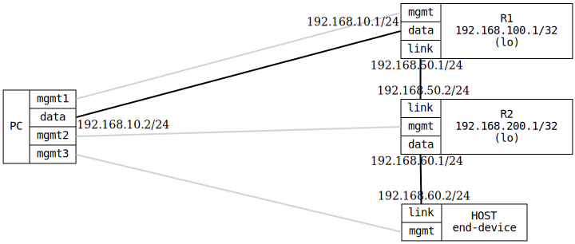

=== OSPF Basic
==== Description
Verifies basic OSPF functionality by configuring two routers (R1 and R2)
with OSPF on their interconnecting link.  The test ensures OSPF
neighbors are established, routes are exchanged between the routers, and
end-to-end connectivity is achieved.

An end-device (HOST) is connected to R2 on an interface without OSPF enabled.
This verifies that OSPF status information remains accessible when a router
has non-OSPF interfaces.

==== Topology
ifdef::topdoc[]
image::{topdoc}../../test/case/ietf_routing/ospf_basic/topology.svg[OSPF Basic topology]
endif::topdoc[]
ifndef::topdoc[]
ifdef::testgroup[]
image::ospf_basic/topology.svg[OSPF Basic topology]
endif::testgroup[]
ifndef::testgroup[]

endif::testgroup[]
endif::topdoc[]
==== Test sequence
. Set up topology and attach to target DUTs
. Configure targets
. Wait for OSPF routes
. Verify R2 OSPF neighbors with non-OSPF interface
. Test connectivity from PC:data to 192.168.200.1

<<<

