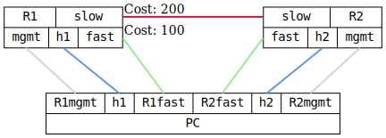

=== OSPF BFD
==== Description
Verify that a router running OSPF, with Bidirectional Forwarding
Detection (BFD) enabled, will detect link faults even when the
physical layer is still operational.

This can typically happen when one logical link, from OSPF's
perspective, is made up of multiple physical links containing media
converters without link fault forwarding.

==== Topology
ifdef::topdoc[]
image::../../test/case/ietf_routing/ospf_bfd/topology.svg[OSPF BFD topology]
endif::topdoc[]
ifndef::topdoc[]
ifdef::testgroup[]
image::ospf_bfd/topology.svg[OSPF BFD topology]
endif::testgroup[]
ifndef::testgroup[]

endif::testgroup[]
endif::topdoc[]
==== Test sequence
. Set up topology and attach to target DUTs
. Setup TPMR between R1fast and R2fast
. Configure R1 and R2
. Setup IP addresses and default routes on h1 and h2
. Wait for R1 and R2 to peer
. Verify connectivity from PC:src to PC:dst via fast link
. Disable forwarding between R1fast and R2fast to trigger fail-over
. Verify connectivity from PC:src to PC:dst via slow link

<<<

