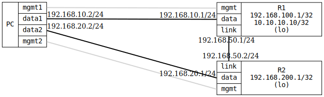

=== OSPF Default route advertise
==== Description
Verify _default-route-advertising_ in OSPF, sometimes called 'redistribute origin'. Verify both
always (regardless if a local default route exist or not) and only redistribute
when local default route exist.

The test is performed by setting a default route on R1 to 192.168.10.2, and setting
_default-route-advertising_ in OSPF, this will result that R2 will see a default route.

When set interface R1:data down, OSPF will no longer redistribute default route to R2,
unless _always_ is set for _default-route-advertising_.
....
 +-------------------+      Area 0            +------------------+
 |       R1          |.1  192.168.50.0/24   .2|      R2          |
 | 192.169.100.1/32  +------------------------+  192.168.200.1/32|
 | 10.10.10.10/32    |R1:link         R2:link |                  |
 +--------------+----+                        +---+--------------+
        R1:data |.1                       R2:data |.1
                |                                 |
                | 192.168.10.0/24                 | 192.168.20.0/24
                |                                 |
    host:data1  |.2                    host:data2 |.2
          +-----+---------------------------------+-------+
          |                                               |
          |             host                              |
          |                                               |
          +-----------------------------------------------+
....

==== Topology
ifdef::topdoc[]
image::../../test/case/ietf_routing/ospf_default_route_advertise/topology.svg[OSPF Default route advertise topology]
endif::topdoc[]
ifndef::topdoc[]
ifdef::testgroup[]
image::ospf_default_route_advertise/topology.svg[OSPF Default route advertise topology]
endif::testgroup[]
ifndef::testgroup[]

endif::testgroup[]
endif::topdoc[]
==== Test sequence
. Set up topology and attach to target DUTs
. Configure targets
. Verify R2 has a default route and 192.168.100.1/32 from OSPF
. Verify connectivity from PC:data2 to 10.10.10.10
. Disable link PC:data1 <--> R1:data (take default gateway down)
. Verify R2 does not have a default route but a 192.168.100.1/32 from OSPF
. Verify no connectivity from PC:data2 to 10.10.10.10
. Enable redistribute default route 'always' on R1
. Wait for all neighbors to peer
. Verify R2 has a default route and 192.168.100.1/32 from OSPF
. Verify connectivity from PC:data2 to 10.10.10.10

<<<

