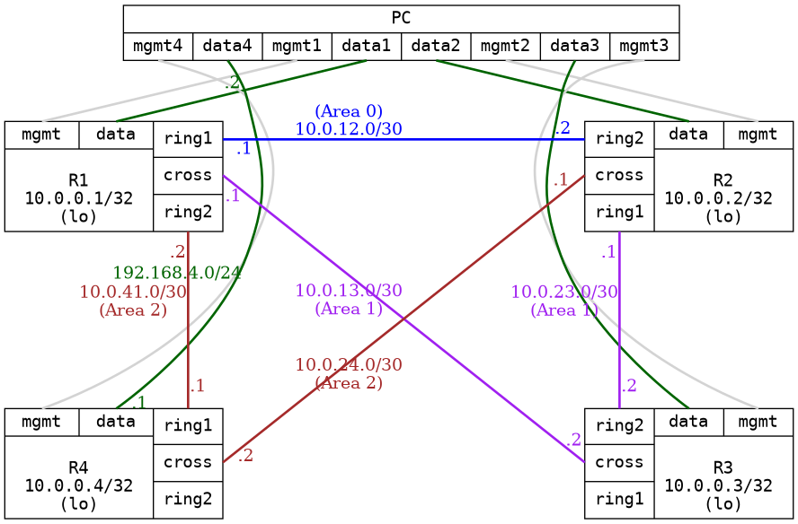

=== OSPF with multiple areas
==== Description
This test test alot of features inside OSPF using 3 areas (one NSSA area, with no summary)
to test the distribution of routes is deterministic (using cost), also test
link breaks using BFD (not implemented in infamy though)

This test also verify broadcast and point-to-point interface type on /30 network and
explicit router-id.

==== Topology
ifdef::topdoc[]
image::../../test/case/ietf_routing/ospf_multiarea/topology.png[OSPF with multiple areas topology]
endif::topdoc[]
ifndef::topdoc[]
ifdef::testgroup[]
image::ospf_multiarea/topology.png[OSPF with multiple areas topology]
endif::testgroup[]
ifndef::testgroup[]

endif::testgroup[]
endif::topdoc[]
==== Test sequence
. Configure targets
. Wait for all neighbor to peer
. Wait for routes from OSPF on all routers
. Verify Area 0.0.0.1 on R3 is NSSA area
. Verify R1:ring2 is of type point-to-point
. Verify R4:ring1 is of type point-to-point
. Verify on R3, there are no routes beyond 10.0.23.1, just a default route
. Testing connectivitiy through NSSA area, from PC:data3 to 11.0.8.1
. Verify that the route to 10.0.0.3 from PC:data4, go through 10.0.41.2
. Break link R1:ring2 --- R4:ring1
. Verify that the route to 10.0.0.3 from PC:data4, go through 10.0.24.1

<<<

