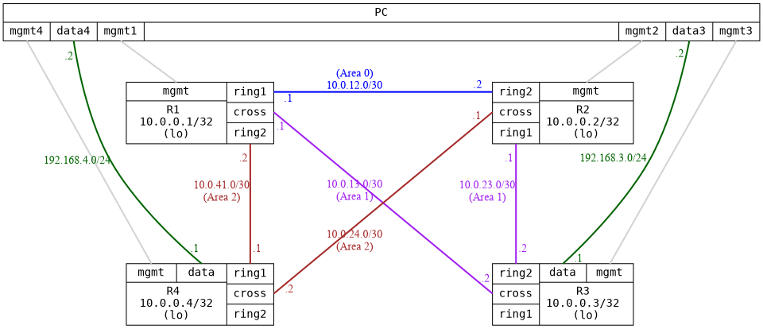

=== OSPF with multiple areas
==== Description
This test evaluates various OSPF features across three areas (one NSSA area, with no summary)
to ensure that route distribution is deterministic (based on cost). It also tests link
failures using BFD, though BFD is not yet implemented in test framework (Infamy).

This test also verifies broadcast and point-to-point interface types on /30 network, and
explicit router-id.

....
  +-------------+  +---------------+  +-------------+  +---------------+
  |     R1      |  |      R2       |  |     R3      |  |      R4       |
  | 10.0.0.1/32 |  |  10.0.0.2/32  |  | 10.0.0.3/32 |  |  10.0.0.4/32  |
  |   (lo)      |  |  11.0.9.1/24  |  |   (lo)      |  |      (lo)     |
  +-------------+  |  11.0.10.1/24 |  +-------------+   +---------------+
                   |  11.0.11.1/24 |
                   |  11.0.12.1/24 |
                   |  11.0.13.1/24 |
                   |  11.0.14.1/24 |
                   |  11.0.15.1/24 |
                   |      (lo)     |
                   +---------------+
....

==== Topology
ifdef::topdoc[]
image::../../test/case/ietf_routing/ospf_multiarea/topology.png[OSPF with multiple areas topology]
endif::topdoc[]
ifndef::topdoc[]
ifdef::testgroup[]
image::ospf_multiarea/topology.png[OSPF with multiple areas topology]
endif::testgroup[]
ifndef::testgroup[]

endif::testgroup[]
endif::topdoc[]
==== Test sequence
. Set up topology and attach to target DUTs
. Configure targets
. Wait for all neighbors to peer
. Wait for routes from OSPF on all routers
. Verify Area 0.0.0.1 on R3 is NSSA area
. Verify R1:ring2 is of type point-to-point
. Verify R4:ring1 is of type point-to-point
. Verify on R3, there are no routes beyond 10.0.23.1, just a default route
. Testing connectivity through NSSA area, from PC:data3 to 11.0.8.1
. Verify that the route to 10.0.0.3 from PC:data4, go through 10.0.41.2
. Break link R1:ring2 --- R4:ring1
. Verify that the route to 10.0.0.3 from PC:data4, go through 10.0.24.1

<<<

