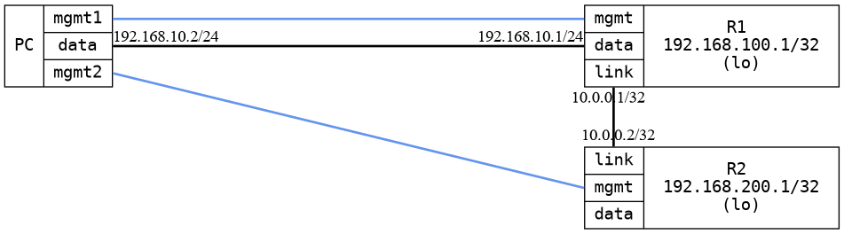

=== OSPF unnumbered interfaces
==== Description
This test that a configuration expecting unnumbered interfaces
get that also in OSPF. Also verify that passive interface in
the configuration gets activated in OSPF.

When this test pass, you can expect unnumbered interfaces, interface type
configuration and passive to function

==== Topology
ifdef::topdoc[]
image::/home/lazzer/Documents/addiva/infix/test/case/ietf_routing/ospf_unnumbered_interface/topology.png[OSPF unnumbered interfaces topology]

endif::topdoc[]
ifndef::topdoc[]
ifdef::testgroup[]
image::lazzer/Documents/addiva/infix/test/case/ietf_routing/ospf_unnumbered_interface/topology.png[OSPF unnumbered interfaces topology]

endif::testgroup[]
ifndef::testgroup[]

endif::testgroup[]
endif::topdoc[]
==== Test sequence
. Initialize
. Configure targets
. Wait for OSPF routes
. Check interface type
. Test passive interface
. Test connectivity

<<<

