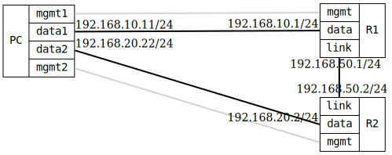

=== Route preference: Static Route Activation and Maximum Distance
==== Description
This test configures a device with a static route to a destination with 
a moderate routing preference (254), verifying that it becomes active. 
Then, the routing preference is increased to the maximum value (255), 
which should prevent the route from becoming active.

==== Topology
ifdef::topdoc[]
image::../../test/case/ietf_routing/route_pref_255/topology.svg[Route preference: Static Route Activation and Maximum Distance topology]
endif::topdoc[]
ifndef::topdoc[]
ifdef::testgroup[]
image::route_pref_255/topology.svg[Route preference: Static Route Activation and Maximum Distance topology]
endif::testgroup[]
ifndef::testgroup[]

endif::testgroup[]
endif::topdoc[]
==== Test sequence
. Set up topology and attach to target DUTs
. Configure targets with active static route
. Verify that static route with preference 254 is active
. Update static route preference to 255
. Verify that high-preference static route (255) does not become active

<<<

