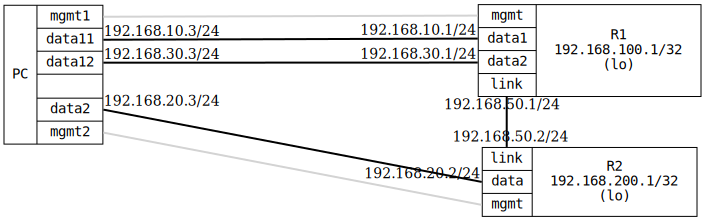

=== Route preference: DHCP vs Static
==== Description
This test configures a device with both a DHCP-acquired route on a
dedicated interface and a static route to the same destination on
another interface.

Initially, DHCP is preferred over Static. Afterwards, the static
route takes precedence by adjusting the routing preference value
to the one lower than DHCP.

==== Topology
ifdef::topdoc[]
image::{topdoc}../../test/case/ietf_routing/route_pref_dhcp/topology.svg[Route preference: DHCP vs Static topology]
endif::topdoc[]
ifndef::topdoc[]
ifdef::testgroup[]
image::route_pref_dhcp/topology.svg[Route preference: DHCP vs Static topology]
endif::testgroup[]
ifndef::testgroup[]

endif::testgroup[]
endif::topdoc[]
==== Test sequence
. Set up topology and attach to target DUTs
. Configure targets. Assign higher priority to the dhcp route
. Wait for DHCP and static routes
. Verify connectivity from PC:data12 to R2:lo via DHCP
. Assign higher priority to the static route
. Verify connectivity from PC:data12 to R2:lo via static route

<<<

