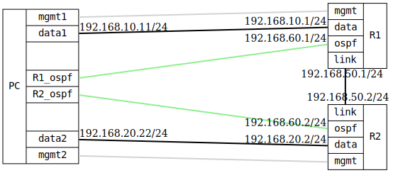

=== Route preference: OSPF vs Static
==== Description
This test configures a device with both an OSPF-acquired route on a
dedicated interface and a static route to the same destination on
another interface. The static route has a higher preference value than
OSPF.

Initially, the device should prefer the OSPF route; if the OSPF route 
becomes unavailable, the static route should take over.

==== Topology
ifdef::topdoc[]
image::{topdoc}../../test/case/ietf_routing/route_pref_ospf/topology.svg[Route preference: OSPF vs Static topology]
endif::topdoc[]
ifndef::topdoc[]
ifdef::testgroup[]
image::route_pref_ospf/topology.svg[Route preference: OSPF vs Static topology]
endif::testgroup[]
ifndef::testgroup[]

endif::testgroup[]
endif::topdoc[]
==== Test sequence
. Set up topology and attach to target DUTs
. Set up TPMR between R1ospf and R2ospf
. Configure targets
. Set up persistent MacVlan namespaces
. Wait for OSPF and static routes
. Verify connectivity from PC:data1 to PC:data2 via OSPF
. Simulate OSPF route loss by blocking OSPF interface
. Verify connectivity via static route after OSPF failover

<<<

