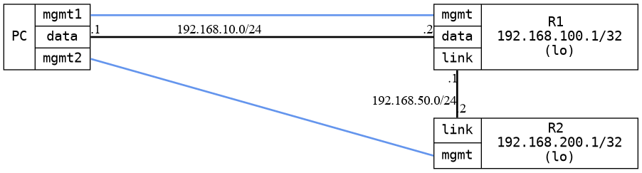

=== Static routing
==== Description
Test that it is possible to use static routes (IPv4 and IPv6)
works as expected

==== Topology
ifdef::topdoc[]
image::../../test/case/ietf_routing/static_routing/topology.png[Static routing topology]
endif::topdoc[]
ifndef::topdoc[]
ifdef::testgroup[]
image::static_routing/topology.png[Static routing topology]
endif::testgroup[]
ifndef::testgroup[]

endif::testgroup[]
endif::topdoc[]
==== Test sequence
. Initialize
. Configure targets
. Wait for routes
. Configure host addresses and routes
. Verify that dut2 is reachable from host over IPv4
. Verify that dut2 is reachable from host over IPv6
. Remove static routes on dut1
. Verify that dut2 is no longer reachable

<<<

