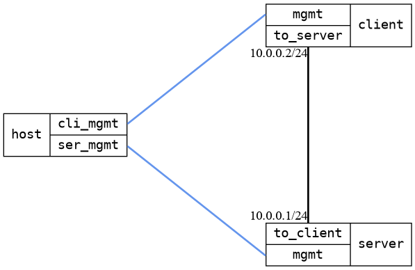

=== Remote syslog
==== Description
Verify logging to remote, acting as a remote, and RFC5424 log format.

==== Topology
ifdef::topdoc[]
image::../../test/case/ietf_syslog/remote/topology.png[Remote syslog topology]
endif::topdoc[]
ifndef::topdoc[]
ifdef::testgroup[]
image::remote/topology.png[Remote syslog topology]
endif::testgroup[]
ifndef::testgroup[]

endif::testgroup[]
endif::topdoc[]
==== Test sequence
. Set up topology and attach to client and server DUTs
. Configure client DUT as syslog client with server DUT as remote, and configure server DUT as syslog server
. Send security:notice log message from client
. Verify reception of client log message, incl. sorting to /log/security on server

<<<

