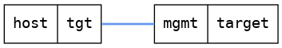

=== Set hostname
==== Description
Verify that it is possible to change hostname.

==== Topology
ifdef::topdoc[]
image::../../test/case/ietf_system/hostname/topology.png[Set hostname topology]
endif::topdoc[]
ifndef::topdoc[]
ifdef::testgroup[]
image::hostname/topology.png[Set hostname topology]
endif::testgroup[]
ifndef::testgroup[]

endif::testgroup[]
endif::topdoc[]
==== Test sequence
. Connect to device
. Set hostname to 'h0stn4m3'

<<<

