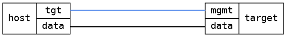

=== Container basic
==== Description
Verify that a simple web server container can be configured to run
with host networking, on port 80.  Operation is verified using a
simple GET request for index.html and checking for a key phrase.

The RPC actions: stop + start, and restart are also verified.

==== Topology
ifdef::topdoc[]
image::../../test/case/infix_containers/container_basic/topology.png[Container basic topology]
endif::topdoc[]
ifndef::topdoc[]
ifdef::testgroup[]
image::container_basic/topology.png[Container basic topology]
endif::testgroup[]
ifndef::testgroup[]

endif::testgroup[]
endif::topdoc[]
==== Test sequence
. Set up topology and attach to target DUT

<<<

