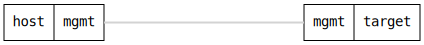

=== Container enabled/disabled
==== Description
Verify that a container can be enabled and disabled via configuration.
Tests the 'enabled' leaf functionality by:

1. Creating an enabled container and verifying it starts
2. Disabling the container and verifying it stops
3. Re-enabling the container and verifying it starts again

Uses operational datastore to verify container running status.

==== Topology
ifdef::topdoc[]
image::{topdoc}../../test/case/infix_containers/container_enabled/topology.svg[Container enabled/disabled topology]
endif::topdoc[]
ifndef::topdoc[]
ifdef::testgroup[]
image::container_enabled/topology.svg[Container enabled/disabled topology]
endif::testgroup[]
ifndef::testgroup[]

endif::testgroup[]
endif::topdoc[]
==== Test sequence
. Set up topology and attach to target DUT
. Set hostname to 'container-host'
. Create enabled container from bundled OCI image
. Verify container has started
. Let container settle
. Disable container
. Verify container has stopped
. Re-enable container
. Verify container has started again

<<<

