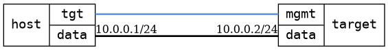

=== Container with VETH pair
==== Description
Verify connectivity with a simple web server container from behind a
regular bridge, a VETH pair connects the container to the bridge.

....
  .-------------.         .---------------.     .--------.
  |      | mgmt |---------| mgmt |        |     |  web-  |
  | host | data |---------| data | target |     | server |
  '-------------'         '---------------'     '--------'
                             |                    /
                            br0                  /
                              `----- veth0 -----'
....

==== Topology
ifdef::topdoc[]
image::../../test/case/infix_containers/container_veth/topology.png[Container with VETH pair topology]
endif::topdoc[]
ifndef::topdoc[]
ifdef::testgroup[]
image::container_veth/topology.png[Container with VETH pair topology]
endif::testgroup[]
ifndef::testgroup[]

endif::testgroup[]
endif::topdoc[]
==== Test sequence
. Set up topology and attach to target DUT
. Create 'web-br0-veth' container from bundled OCI image
. Verify container 'web-br0-veth' has started
. Verify basic DUT connectivity, host:data can ping DUT 10.0.0.2
. Verify container 'web-br0-veth' is reachable on http://10.0.0.2:91

<<<

