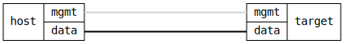

=== Container Volume Persistence
==== Description
Verify that a container created from a local OCI archive, with a volume
for persistent content, can be upgraded at runtime, without losing the
content in the volume on restart.

==== Topology
ifdef::topdoc[]
image::{topdoc}../../test/case/infix_containers/container_volume/topology.svg[Container Volume Persistence topology]
endif::topdoc[]
ifndef::topdoc[]
ifdef::testgroup[]
image::container_volume/topology.svg[Container Volume Persistence topology]
endif::testgroup[]
ifndef::testgroup[]

endif::testgroup[]
endif::topdoc[]
==== Test sequence
. Set up topology and attach to target DUT
. Create container with volume from bundled OCI image
. Verify container has started
. Modify container volume content
. Verify container volume content
. Upgrade container
. Verify container volume content survived upgrade

<<<

