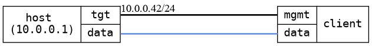

=== DHCP Basic
==== Description
This is a very basic DHCP test that requests an IPv4 lease
from a DHCP server and checks that the lease is set on the
 interface.

==== Topology
ifdef::topdoc[]
image::/home/lazzer/Documents/addiva/infix/test/case/infix_dhcp/dhcp_basic/topology.png[DHCP Basic topology]

endif::topdoc[]
ifndef::topdoc[]
ifdef::testgroup[]
image::lazzer/Documents/addiva/infix/test/case/infix_dhcp/dhcp_basic/topology.png[DHCP Basic topology]

endif::testgroup[]
ifndef::testgroup[]

endif::testgroup[]
endif::topdoc[]
==== Test sequence
. Initialize

<<<

