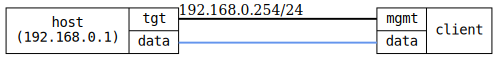

=== DHCP router
==== Description
Verify that the DHCP client receives default gateway (DHCP option 3, router)
and that route exists in operational datastore.

==== Topology
ifdef::topdoc[]
image::../../test/case/infix_dhcp/dhcp_router/topology.svg[DHCP router topology]
endif::topdoc[]
ifndef::topdoc[]
ifdef::testgroup[]
image::dhcp_router/topology.svg[DHCP router topology]
endif::testgroup[]
ifndef::testgroup[]

endif::testgroup[]
endif::topdoc[]
==== Test sequence
. Initialize
. Verify client to set up default route via 192.168.0.254

<<<

