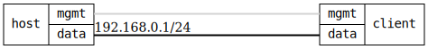

=== DHCP option 121 vs option 3
==== Description
Verify that DHCP option 121 (classless static routes) is used over the
older option 3 (default gateway) in the DHCP client, see RFC3442.  Use
the routing RIB in the operational datastore to verify.

Installing routes from a DHCP server should not affect already existing
(static) routes.  To verify this, a static canary route is set in the
client before starting the DHCP client.  This canary route does not need
to be reachable before a DHCP lease has been acquired.

==== Topology
ifdef::topdoc[]
image::../../test/case/infix_dhcp/dhcp_routes/topology.svg[DHCP option 121 vs option 3 topology]
endif::topdoc[]
ifndef::topdoc[]
ifdef::testgroup[]
image::dhcp_routes/topology.svg[DHCP option 121 vs option 3 topology]
endif::testgroup[]
ifndef::testgroup[]

endif::testgroup[]
endif::topdoc[]
==== Test sequence
. Setting up client
. Verify 'client' has a route to 10.0.0.0/24 via 192.168.0.254
. Verify 'client' has a default route via 192.168.0.254
. Verify 'client' has a route to 20.0.0.0/24 via 192.168.0.2

<<<

