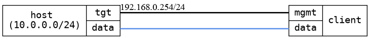

=== DHCP option 121 vs option 3
==== Description
Verify DHCP option 121 (static routes) is used over option 3 and that the
routes exist in the operational datastore.

Installing unrelated routes from a DHCP server should not affect already
existing routes.  To verify this a canary route is set up in the client
before initiating DHCP.  This canary route does not need to be reachable
before a DHCP lease has been acquired.

==== Topology
ifdef::topdoc[]
image::../../test/case/infix_dhcp/dhcp_routes/topology.png[DHCP option 121 vs option 3 topology]
endif::topdoc[]
ifndef::topdoc[]
ifdef::testgroup[]
image::dhcp_routes/topology.png[DHCP option 121 vs option 3 topology]
endif::testgroup[]
ifndef::testgroup[]

endif::testgroup[]
endif::topdoc[]
==== Test sequence
. Setting up client
. Verify 'client' has a route to 10.0.0.0/24 via 192.168.0.254
. Verify 'client' has a default route via 192.168.0.254
. Verify 'client' has a route to 20.0.0.0/24 via 192.168.0.2

<<<

