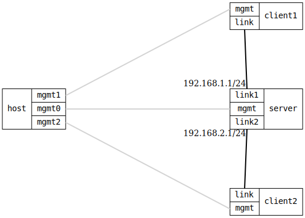

=== DHCP Server Static Host
==== Description
Verify DHCP server can hand out static host leases based on client-id,
both hexadecimal and a very long string, ensuring no pool address is
handed out instead.

==== Topology
ifdef::topdoc[]
image::{topdoc}../../test/case/infix_dhcp/server_host/topology.svg[DHCP Server Static Host topology]
endif::topdoc[]
ifndef::topdoc[]
ifdef::testgroup[]
image::server_host/topology.svg[DHCP Server Static Host topology]
endif::testgroup[]
ifndef::testgroup[]

endif::testgroup[]
endif::topdoc[]
==== Test sequence
. Set up topology and attach to client and server DUTs
. Configure DHCP client and server DUTs
. Verify DHCP client1 static lease
. Verify client1 hostname has *not* changed
. Verify DHCP client1 has default route via option 121
. Verify DHCP client2 static lease
. Verify client2 hostname has changed
. Verify DHCP client2 has default gateway

<<<

