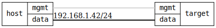

=== Basic firewall test for end devices
==== Description
Test a simple restrictive firewall configuration suitable for end devices
like laptops or phones on untrusted networks.

The test verifies:
- Single zone configuration similar to firewalld's default "public" zone
- Zone "public" with action=drop for data interface
- Zone "mgmt" with action=accept for management interface (NETCONF/RESTCONF)
- Allowed services: SSH (port 22), DHCPv6-client
- Blocked: All other ports (HTTP, HTTPS, Telnet, etc.)

Port scanning tests validate that:
- SSH access is allowed (for management)
- All non-essential services are blocked/filtered
- Firewall properly filters unwanted traffic

Uses the infamy.PortScanner class with netcat to test port accessibility:
- Open: Port accessible (service running)
- Closed: Port not filtered but no service listening
- Filtered: Port blocked by firewall (timeout/drop)

This provides suitable protection for end-device scenarios while
maintaining management access for testing.

==== Topology
ifdef::topdoc[]
image::{topdoc}../../test/case/infix_firewall/basic/topology.svg[Basic firewall test for end devices topology]
endif::topdoc[]
ifndef::topdoc[]
ifdef::testgroup[]
image::basic/topology.svg[Basic firewall test for end devices topology]
endif::testgroup[]
ifndef::testgroup[]

endif::testgroup[]
endif::topdoc[]
==== Test sequence
. Set up topology and attach to target
. Configure basic end-device firewall
. Verify ICMP is dropped
. Verify ICMPv6 is dropped
. Verify SSH port (22) is allowed
. Verify well-known ports are blocked except SSH

<<<

