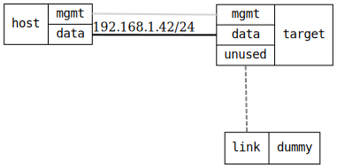

=== Basic Firewall for End Devices

ifdef::topdoc[:imagesdir: {topdoc}../../test/case/infix_firewall/basic]

==== Description

Firewall configuration suitable for end devices on untrusted networks.

- Single zone configuration, "public", with action=drop
- Allowed services: SSH (port 22), DHCPv6-client, mySSH (custom, port 222)
- All other ports (HTTP, HTTPS, Telnet, etc.) blocked
- Check that unused interfaces are automatically assigned to default zone

==== Topology

==== Sequence

. Set up topology and attach to target
. Configure basic end-device firewall
. Verify unused interface assigned to default zone
. Verify ICMP is dropped
. Verify ICMPv6 is dropped
. Verify SSH service is allowed
. Verify custom mySSH service is allowed
. Verify HTTP service override (8080 allowed, 80 blocked)
. Verify other ports are blocked

