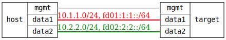

=== IPv6 Zone Migration with Custom Services

ifdef::topdoc[:imagesdir: {topdoc}../../test/case/infix_firewall/ipv6-zone-migration]

==== Description

This test verifies that firewall rules work consistently across IPv4/IPv6
protocols and that interfaces can be moved between zones without breaking
active connections.

- Requires DUT with at least 2 data interfaces supporting IPv6
- Test host must support dual-stack IPv4/IPv6 configuration
- Custom service ports (8080/tcp) should be available for testing

==== Topology

==== Sequence

. Set up topology and attach to target
. Configure dual-stack interfaces and initial firewall
. Verify initial zone configuration and custom service
. Verify IPv4/IPv6 connectivity and custom service restrictions
. Verify IPv6 custom service functionality
. Perform dynamic zone migration
. Verify connectivity after zone migration
. Verify custom service from migrated interface
. Verify operational state reflects zone changes

