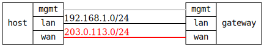

=== LAN-WAN firewall test with masquerading
==== Description
Test a typical home/office router scenario where the target device acts as
a gateway with LAN-to-WAN traffic forwarding and masquerading (SNAT).

Architecture:
- Target device = Gateway with firewall and NAT
- Test host has two interfaces: one LAN-side, one WAN-side (Internet)
- Test host's LAN interface acts as a client behind the router
- Test host's WAN interface acts as an Internet server/destination

The test verifies:
- LAN zone with action=accept for internal traffic
- WAN zone with action=drop for external interface
- Policy to allow LAN-to-WAN forwarding with masquerading
- Interface forwarding enabled on router
- Outbound connectivity from LAN clients through WAN works
- Inbound unsolicited traffic from WAN is blocked
- Masquerading (source NAT) functions correctly

This validates a typical home router protecting internal network while
allowing outbound internet access.

==== Topology
ifdef::topdoc[]
image::{topdoc}../../test/case/infix_firewall/lan-wan/topology.svg[LAN-WAN firewall test with masquerading topology]
endif::topdoc[]
ifndef::topdoc[]
ifdef::testgroup[]
image::lan-wan/topology.svg[LAN-WAN firewall test with masquerading topology]
endif::testgroup[]
ifndef::testgroup[]

endif::testgroup[]
endif::topdoc[]
==== Test sequence
. Set up topology and attach to gateway
. Configure gateway with firewall and SNAT
. Verify LAN access to router
. Verify WAN access to router is blocked
. Verify LAN services accessibility
. Verify WAN blocks all well-known ports
. Verify LAN-to-WAN connectivity (outbound)
. Verify WAN-to-LAN blocking (inbound)
. Verify LAN-to-WAN masquerading

<<<

