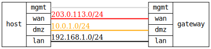

=== WAN-DMZ-LAN Firewall with Port Forwarding
==== Description
Verifies a comprehensive multi-zone firewall setup with port forwarding (DNAT)
and masquerading (SNAT).

Architecture:
- Target device = Gateway with WAN/DMZ/LAN zones and NAT
- Test host has four interfaces: WAN (Internet), DMZ (server zone),
  LAN (internal), mgmt
- Host WAN interface acts as external Internet client
- Host DMZ interface acts as internal server (HTTP on port 80)
- Host LAN interface acts as internal LAN client

The test verifies:
- WAN zone with action=drop for external interface
- DMZ zone with limited services (HTTP only)
- LAN zone with action=accept for internal network
- Port forwarding: WAN:8080 → DMZ:80 (DNAT)
- Policy loc-to-wan: DMZ+LAN → WAN with masquerading (SNAT)
- Policy lan-to-dmz: LAN → DMZ for SSH and HTTP access
- Proper zone isolation and access control
- End-to-end DNAT and SNAT functionality

This validates complex firewall scenarios with both ingress NAT (DNAT)
and egress NAT (SNAT) plus comprehensive multi-zone policies.

==== Topology
ifdef::topdoc[]
image::{topdoc}../../test/case/infix_firewall/wan-dmz-lan/topology.svg[WAN-DMZ-LAN Firewall with Port Forwarding topology]
endif::topdoc[]
ifndef::topdoc[]
ifdef::testgroup[]
image::wan-dmz-lan/topology.svg[WAN-DMZ-LAN Firewall with Port Forwarding topology]
endif::testgroup[]
ifndef::testgroup[]

endif::testgroup[]
endif::topdoc[]
==== Test sequence
. Set up topology and attach to gateway
. Configure gateway with multi-zone firewall and NAT
. Verify basic connectivity within zones
. Verify WAN to DMZ port forwarding (DNAT)
. Verify LAN to DMZ connectivity
. Verify DMZ to LAN blocking
. Verify WAN isolation
. Verify LAN to WAN connectivity with SNAT
. Verify DMZ to WAN connectivity with SNAT
. Verify comprehensive zone policies

<<<

