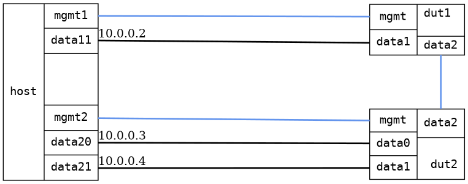

=== Bridge forwarding dual DUTs
==== Description
Ping through both DUTs using bridged ports.

==== Topology
ifdef::topdoc[]
image::/home/lazzer/Documents/addiva/infix/test/case/infix_interfaces/bridge_fwd_dual_dut/topology.png[Bridge forwarding dual DUTs topology]

endif::topdoc[]
ifndef::topdoc[]
ifdef::testgroup[]
image::lazzer/Documents/addiva/infix/test/case/infix_interfaces/bridge_fwd_dual_dut/topology.png[Bridge forwarding dual DUTs topology]

endif::testgroup[]
ifndef::testgroup[]

endif::testgroup[]
endif::topdoc[]
==== Test sequence
. Initialize
. Configure a bridge with triple physical port
. Ping host:data20 [10.0.0.3] and host:data21 [10.0.0.4]from host:data11 [10.0.0.2]

<<<

