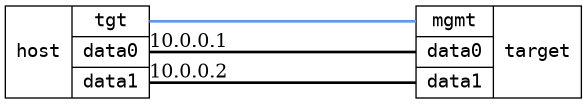

=== Bridge forwarding single DUTs
==== Description
Tests forwarding through a DUT with two bridged interfaces

==== Topology
ifdef::topdoc[]
image::../../test/case/infix_interfaces/bridge_fwd_sgl_dut/topology.png[Bridge forwarding single DUTs topology]
endif::topdoc[]
ifndef::topdoc[]
ifdef::testgroup[]
image::bridge_fwd_sgl_dut/topology.png[Bridge forwarding single DUTs topology]
endif::testgroup[]
ifndef::testgroup[]

endif::testgroup[]
endif::topdoc[]
==== Test sequence
. Initialize
. Configure a bridge with dual physical port
. Ping host:data1 [10.0.0.2] from host:data0 [10.0.0.1]

<<<

