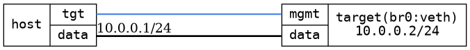

=== Bridge with a physical port and a veth
==== Description
This tests the possibility to add software added ports, in this case
veth and bridge it with a physical port

==== Topology
ifdef::topdoc[]
image::/home/lazzer/Documents/addiva/infix/test/case/infix_interfaces/bridge_veth/topology.png[Bridge with a physical port and a veth topology]

endif::topdoc[]
ifndef::topdoc[]
ifdef::testgroup[]
image::lazzer/Documents/addiva/infix/test/case/infix_interfaces/bridge_veth/topology.png[Bridge with a physical port and a veth topology]

endif::testgroup[]
ifndef::testgroup[]

endif::testgroup[]
endif::topdoc[]
==== Test sequence
. Initialize
. Configure bridged eth port and veth pair with IP 10.0.0.2
. Ping other end of bridged veth pair on 10.0.0.2 from host:data with IP 10.0.0.1

<<<

