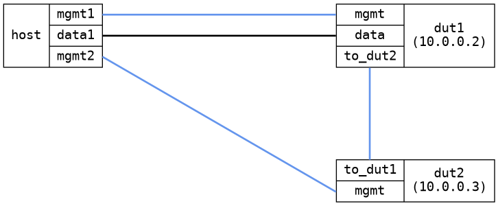

=== Bridge VLAN
==== Description
Basic test of VLAN functionality in a bridge

==== Topology
ifdef::topdoc[]
image::/home/lazzer/Documents/addiva/infix/test/case/infix_interfaces/bridge_vlan/topology.png[Bridge VLAN topology]

endif::topdoc[]
ifndef::topdoc[]
ifdef::testgroup[]
image::lazzer/Documents/addiva/infix/test/case/infix_interfaces/bridge_vlan/topology.png[Bridge VLAN topology]

endif::testgroup[]
ifndef::testgroup[]

endif::testgroup[]
endif::topdoc[]
==== Test sequence
. Initialize
. Topology setup
. Connectivity check

<<<

