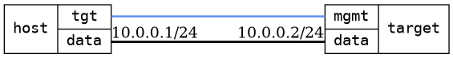

=== Dual bridges
==== Description
Test that it is possible to ping a bridge through a bridge to another bridge

==== Topology
ifdef::topdoc[]
image::/home/lazzer/Documents/addiva/infix/test/case/infix_interfaces/dual_bridge/topology.png[Dual bridges topology]

endif::topdoc[]
ifndef::topdoc[]
ifdef::testgroup[]
image::lazzer/Documents/addiva/infix/test/case/infix_interfaces/dual_bridge/topology.png[Dual bridges topology]

endif::testgroup[]
ifndef::testgroup[]

endif::testgroup[]
endif::topdoc[]
==== Test sequence
. Initialize
. Configure two bridges linked with a veth pair furthest bridge has IP 10.0.0.2
. Ping furthest bridge 10.0.0.2 from host:data with IP 10.0.0.1

<<<

