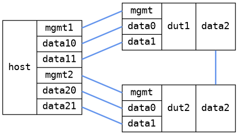

=== IGMP VLAN
==== Description
Test tagged IGMP control traffic and that VLAN separation is respected for multicast

==== Topology
ifdef::topdoc[]
image::/home/lazzer/Documents/addiva/infix/test/case/infix_interfaces/igmp_vlan/topology.png[IGMP VLAN topology]

endif::topdoc[]
ifndef::topdoc[]
ifdef::testgroup[]
image::lazzer/Documents/addiva/infix/test/case/infix_interfaces/igmp_vlan/topology.png[IGMP VLAN topology]

endif::testgroup[]
ifndef::testgroup[]

endif::testgroup[]
endif::topdoc[]
==== Test sequence
. Initialize
. Configure device
. Check multicast receieved on correct port and VLAN
. Multicast does not exist on ports/VLANs where they should not be
. Multicast received on correct port and VLAN

<<<

