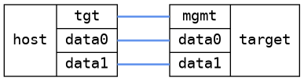

=== VLAN QoS
==== Description
Inject different packets from the host and verify that the VLAN priority
is handled correctly

==== Topology
ifdef::topdoc[]
image::../../test/case/infix_interfaces/vlan_qos/topology.png[VLAN QoS topology]
endif::topdoc[]
ifndef::topdoc[]
ifdef::testgroup[]
image::vlan_qos/topology.png[VLAN QoS topology]
endif::testgroup[]
ifndef::testgroup[]

endif::testgroup[]
endif::topdoc[]
==== Test sequence
. Initialize
. Apply initial config without priority mapping
. Setup host VLANs

<<<

