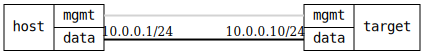

ifdef::topdoc[:imagesdir: {topdoc}../../test/case/infix_services/lldp/lldp_admin_status]

=== LLDP admin status
==== Description
Verify that LLDP admin status is set properly by lldpd

==== Topology

==== Sequence
. Set up topology and attach to target DUT
. Enable target interface and enable LLDP
. Verify admin-status: 'rx-only'
. Verify admin-status: 'tx-only'
. Verify admin-status: 'disabled'
. Verify admin-status: 'tx-and-rx'

